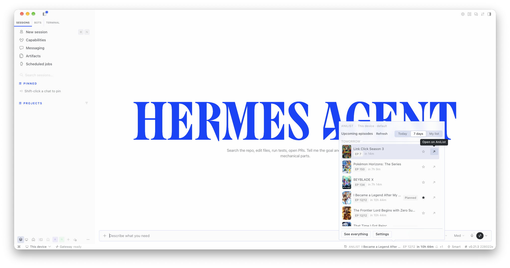
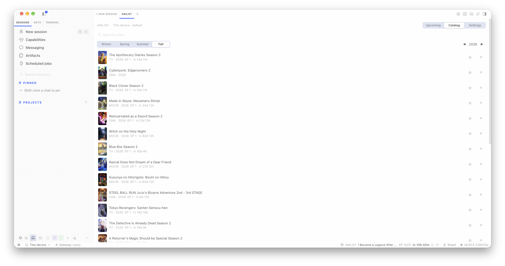
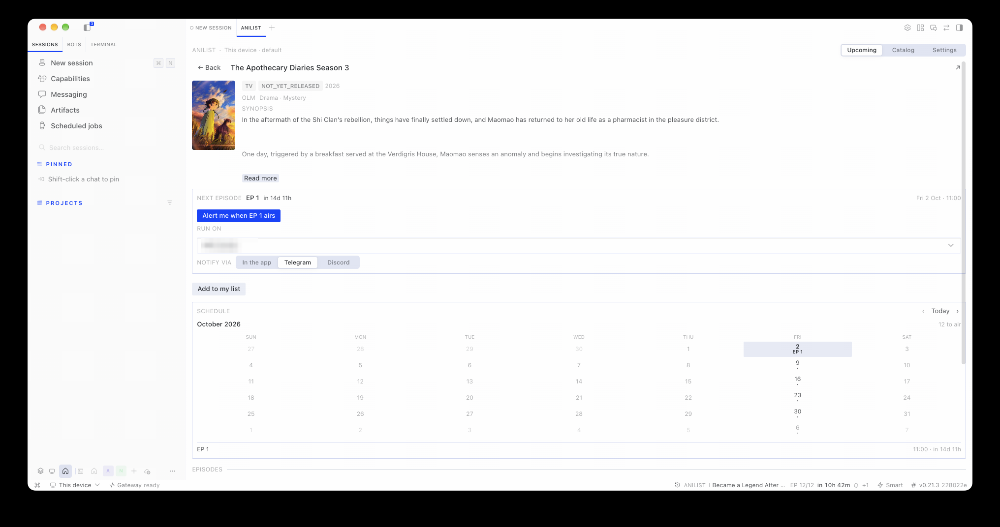

# hermes-anilist

AniList tracker for **Hermes Desktop** — airing countdowns, a season browser, episode alerts and
agent tools over your own list, without leaving Hermes. It is deliberately small in what it asks of
you: nothing but AniList is contacted, the renderer never holds a credential, every read works signed
out, and everything that writes — your list, an alert, the digest — is an action you take.

**Built with `@Hermes`.** Every line of this plugin — the desktop half, the backend, the agent tools,
the tests and this README — was developed with
[Hermes Agent](https://hermes-agent.nousresearch.com/) doing the implementation, driven by the repo's
owner and running mostly on **`deepseek-v4.1-flash`**. The taste, the screenshots and the bug reports
are human; the code is not.

> **Status: 0.8.0.** The pane, the AniList backend (read *and* write), the pin-flow sign-in, the cron
> alerts, the daily digest and the two agent tools all work today. Next: the catalog PR (which opens
> once the pinned commit is two weeks old) and the agent's writing tools.

---

## What it is

A Hermes plugin with three halves in one installable folder:

| Part | Where | What it does |
|---|---|---|
| Desktop half | `desktop/plugin.js` | The status-bar chip, the popover it unfolds, the workspace tab (**Upcoming · Catalog · Settings**) and the show page |
| Backend half | `dashboard/plugin_api.py` | The only thing that talks to AniList — HTTP client, cache and rate-limit budget live here |
| Agent half | `tools.py`, `__init__.py`, `skills/usage/SKILL.md` | The two tools the model calls, the native entry point that registers them, and the skill that teaches when to use them |

The renderer never holds a credential: it only ever sees public data and a `connected` flag.

## Screenshots

Taken from the app itself, on a real account and a real list — no mock data, and no credential anywhere
in frame: the pane only ever renders public AniList data and your own list. Each file's window size,
surface and theme are recorded in [`docs/screenshots/manifest.json`](docs/screenshots/manifest.json).

| | |
|---|---|
|  | **The chip and its popover.** What the plugin adds to the status bar, opened: the airing window sectioned by local day, `Today / 7 days / My list`, a row's hover action, and the two doors out — the full workspace and Settings. |
|  | **Workspace ▸ Catalog.** Browsing a season and year, search above, and the star on every row that puts a show on your list. |
|  | **Workspace ▸ a show.** The next-episode card leading the page with its alert action, the month calendar of air dates, and the episode list below. |

## Capabilities

| Capability | Where | What it does |
|---|---|---|
| **Status-bar chip** | Status bar | Names the next episode of *your* list with a countdown (`EP 12/12 in 1h 7m`), a clock icon that turns into a broadcast mark within the hour, a `+N` for the rest of your next 24 hours, and a bell once a reminder is armed for that episode |
| **Airing feed** | Chip → popover | Your window (3 / 7 / 14 days) sectioned by local day — **Today / Tomorrow / Fri 19** — with a cursor-backed **Show more**, plus search and the two doors out: the full workspace and Settings |
| **Season browser** | Workspace ▸ **Catalog** | Any season and year, or a debounced title search |
| **My list** | Workspace ▸ Upcoming / Catalog | Star any show from any row; the **My list** filter narrows the feed to what you track. Account-backed when signed in, local otherwise |
| **Tracking** | Show page | AniList's own statuses (`watching`, `rewatching`, `planned`, `completed`, `paused`, `dropped`), progress ±, and removal behind a confirmation because it deletes the entry on AniList. The score is shown — yours from AniList, never invented — but not editable yet |
| **Show page** | Workspace | Identity, the next episode with its countdown and the alert action, tracking controls, a **month calendar** of its air dates, an episode table with `EP · Day · Date · Time`, and the synopsis beside the cover |
| **Episode alerts** | Show page / Settings | A cron job per episode that fires when it airs — it survives closing Hermes, shows up in `hermes cron list`, and is paused, resumed or cancelled from Settings ▸ *Alerts* |
| **Daily digest** | Settings | One message a day at the hour you pick with what airs from your list; it carries the ids and asks AniList's public API itself, so a host without this plugin can still run it |
| **Agent tools** | Any session | `anilist_list` and `anilist_show` — the model reads the list you actually track and answers about one show (see [Agent tools](#agent-tools)) |
| **Settings** | Workspace ▸ Settings | Title language (English / Romaji / Original), feed window, the filter it opens on, covers, default destination and channel, alerts, and the AniList account |
| **Two languages** | Everywhere | English and Spanish, following the app's language |

## Requirements

- Hermes `>= 0.21` (the Desktop Plugin SDK).
- **No credential for anything read-only.** AniList's public GraphQL API (`https://graphql.anilist.co`)
  needs no key; the budget is 30 requests/minute shared per host, which the backend spends once.
- **For signing in and writing to your list**: your own AniList application (one minute to create) —
  see [Set up your AniList account](#set-up-your-anilist-account). The plugin deliberately ships no
  shared application.

## Install

Two halves, two places. **Which install you run decides what you get**, so read the table before the
commands — a single install no longer covers both:

| You want | Install on | Command |
|---|---|---|
| The tools, the data, the account, the alerts — `anilist_list`, the feed, your watchlist, the digest | **The host that serves your sessions**: this machine's Hermes, or the VPS / SSH box you connect to | `hermes plugins install BatataBF/hermes-anilist` then `hermes plugins enable hermes-anilist` |
| The chip, the popover, the workspace tab | **Every machine that runs Hermes Desktop** (they each load UI from their own disk) | `hermes plugins install BatataBF/hermes-anilist --no-enable` |

The plugin appears in **Capabilities → Plugins** on both, and it is opt-in on both sides: the agent
half needs its `plugins.enabled` entry, the desktop half its toggle in that list.

### 1. On the host — once

Wherever your sessions run. The agent half is the half that holds anything: the watchlist, the
preferences, the AniList token and the alert jobs all live **on that host**, and every device that
connects reads them from there.

```bash
hermes plugins install BatataBF/hermes-anilist     # or: ... --enable, to skip the prompt
hermes plugins enable hermes-anilist
```

Then restart that host's backend — both halves register at startup, so a running session keeps the old
code until then (Desktop: quit and reopen the app; CLI or gateway: `hermes gateway restart`).

On an SSH or remote-gateway connection, this is the install that makes the tools and the routes exist
in those sessions. Nothing else is needed there: the chip is not the host's business.

Once the catalog entry lands, the same install by name — it resolves to the reviewed, pinned commit:

```bash
hermes plugins install hermes-anilist
hermes plugins enable hermes-anilist
```

### 2. On each device that runs the app — once

The desktop half is a plain JavaScript file the app loads **from the machine it runs on**. There is no
remote-source door (a plugin runs with the app's own authority, so loading it from a host you merely
connected to would be remote code execution — Hermes does not do that), which is why each device needs
the file once:

```bash
hermes plugins install BatataBF/hermes-anilist --no-enable
```

`--no-enable` is the point: it drops the package — which is what carries the desktop half — **without
enabling the agent half on that device**. No second watchlist, no second token, no second set of alert
jobs; the device is a reader, the host stays the owner.

Then, in Hermes Desktop:

1. **⌘K → Reload desktop plugins** — the desktop half is opt-in and the app has to be told to look.
2. **Capabilities → Plugins** — flip the **Desktop** toggle on the `hermes-anilist` row.
3. The chip appears in the status bar. Click it.

**Install from Git** (the app's own dialog, reachable from that same page, or with the one-click link
`hermes://plugin/install?repo=BatataBF/hermes-anilist`) does the same thing without a local package:
tick only the **Desktop** target. It is the friendlier route for a device you rarely touch, and the
lesser one for a device you keep: without a package there, the row cannot be paired with the host's
half and `hermes plugins update` has nothing to refresh.

### 3. The surface follows the host

The app loads the desktop half wherever it runs; what that half **shows** belongs to the host. It
registers the chip, the palette commands and the panes only while its own backend answers on the
connection you are on — so a device pointed at a backend without the plugin shows **nothing at all**
(no chip, no commands, no empty state), and grows the whole surface the moment you switch to one that
has it. Switch back and it is gone again.

That is the whole point of the split: **install once on the host, drop the file on each device once,
and no device ever needs a second setup.** Say it the other way round — you never have to keep two
machines in step, because there is only ever one of everything: one watchlist, one credential, one set
of jobs, one set of preferences.

### 4. Updating

| Where | Command |
|---|---|
| The host | `hermes plugins update hermes-anilist`, then restart its backend |
| Each device | `hermes plugins update hermes-anilist` (refreshes its copy of the desktop half; the app picks it up on the next reload) |

A new release is one `update` per machine that has the file. To have Hermes replace the directory from
the repository instead of pulling into it:

```bash
hermes plugins install BatataBF/hermes-anilist --force --enable
hermes gateway restart
```

`--force` deletes the existing plugin directory first, so back up anything you changed there. If you
cloned the plugin yourself instead of letting Hermes install it, update that checkout the way you would
any other (`git pull --ff-only` in the directory) and restart the backend the same way.

Once the catalog entry lands, a catalog install updates differently on purpose: `hermes plugins update`
never runs `git pull` for it — it compares your installed pin against the current catalog pin and
force-reinstalls at the reviewed commit.

> **Never install by symlinking a clone into the plugins directory.** The installer resolves the
> destination and refuses a plugin whose name resolves outside it
> (`hermes_cli/plugins_cmd.py::_sanitize_plugin_name`), so a symlinked install loads fine but is
> **uninstallable** from the Desktop dialog and from `hermes plugins install`. Install by
> `owner/repo` and let Hermes manage its own checkout.

### Where it runs: what follows the host, what follows the machine

The split is worth knowing by heart, because every "where did my plugin go?" answer is in it:

| | Agent half | Desktop half |
|---|---|---|
| Lives in | the **host**'s `plugins/hermes-anilist/` | each machine's `desktop-plugins/hermes-anilist/` |
| Holds | tools, `/api/plugins/hermes-anilist/` routes, watchlist, preferences, token, alert jobs | the chip, the popover, the workspace tab, palette commands |
| Follows | the **connection** you are on (per profile, on that host) | the **machine**, not the connection — one copy per app install, deliberately not per-profile (a half that came and went with the selected profile read as "my plugin vanished") |
| Check it with | `hermes plugins show hermes-anilist` on that host | Capabilities → Plugins, next to the app that loads it |

Two consequences worth knowing up front:

- **Preferences live with the host; nothing durable lives on a device.** Title language, window,
  digest hour and the destination are stored in the host's plugin state, so they are the same on every
  device that connects, and a device keeps only the last answer it was given. The AniList token is the
  same story: signing in from the pane writes it to the profile `.env` of the **host serving that
  connection** — which is why a device never holds a credential, and why signing in twice is signing
  in on two hosts, not twice on one.
- **Alerts and the digest are cron jobs, created through the active connection.** They fire on the
  host that serves that session, whether or not the plugin is installed there, and they show up in
  `hermes cron list` on that host. Create them while you are connected to the host that should own
  them.

## Set up your AniList account

Everything read-only works signed out, against the local list. Connecting an account is what makes
the list *yours*: statuses, progress and scores read from AniList, and edits written back.

Nothing here needs an account: the feed, seasons and search read AniList publicly. Connecting is for
importing and syncing your own list. Each account registers its own app — the plugin ships no shared
credentials.

In the plugin: **Workspace ▸ Settings ▸ AniList account**.

1. **Create an app with this redirect.** Open
   [AniList's developer settings](https://anilist.co/settings/developer) and create a client with the
   redirect URL exactly:

   ```
   https://anilist.co/api/v2/oauth/pin
   ```

   It must match exactly — AniList compares it literally.

2. **Paste its Client ID** into the plugin and press **Save**. The Client ID is public; it is stored
   in the plugin's own profile-scoped state, never in the code.

3. **Get a token and paste it.** Press **Get AniList token** — your browser opens AniList's authorize
   page for your own app — approve it, and copy the token AniList shows. Paste it into the field and
   press **Connect**. The answer comes back as `Connected as <your name>`.

After that the header shows your account's name, **My list** is your real AniList list, and the
tracking controls write to it. **Disconnect** removes the token from the profile; your list on
AniList is untouched.

Everything else — the feed, seasons, search, the local list, alerts, the digest, the agent tools —
keeps working signed out.

## Agent tools

With the plugin enabled the model gets two tools, and they only read:

| Tool | Answers |
|---|---|
| `anilist_list` | "What am I watching this season?", "What of mine airs this week?", "What am I behind on?" — filters `all · airing · behind · not_started`, and an entry in one AniList status. Each row: status, progress, total episodes, your score, season and year, and the next episode with its air time |
| `anilist_show` | "Is this good?", "Do I have the sequels?", "What should I watch next?" — AniList's score (0–100, `null` when there is none), its all-time rankings *with their context*, spoiler-free tags, the score distribution, related works in story order each flagged with whether it is already in your list, the community's recommendations with vote counts, and your own entry |

Rules the tools follow, and the reason they are trustworthy:

- **Every answer names the list it read** — your AniList account's, or the host's own when you are
  signed out. `store: anilist` vs `store: local`.
- **`null` is not zero.** A show AniList has no score for reports `null`, and a score you never set
  is not invented.
- **A title resolves itself and says which show it got**, plus what else matched — so a wrong pick is
  visible instead of silent.
- **Neither tool writes.** Watching an episode for you is a deliberate follow-up, not a side effect of
  a question.

The plugin also ships a skill (`hermes-anilist:usage`, in `skills/usage/SKILL.md`) that teaches the map
from question to tool and those honesty rules. Load it with `skill_view('hermes-anilist:usage')`; it is
not in `~/.hermes/skills/`, so nothing finds it unless a tool description names it.

### The arguments

`anilist_list` — reading the list you track:

```json
{"filter": "behind", "limit": 20}
```

| Argument | Values | Meaning |
|---|---|---|
| `filter` | `all` · `airing` · `behind` · `not_started` | How to narrow. `behind` = the next episode is past what you have watched |
| `status` | `watching` · `rewatching` · `planned` · `completed` · `paused` · `dropped` | Only entries in that AniList status |
| `days` | 1–30 | How far ahead `airing` looks (default 7) |
| `with_next_episode` | boolean | Attach the next episode even with no filter |
| `limit` | 1–50 | Rows to return; a truncated answer says `truncated: true` |

`anilist_show` — everything about one show:

```json
{"title": "frieren", "episodes": 12}
```

| Argument | Values | Meaning |
|---|---|---|
| `title` | 2+ characters | Resolved through AniList search; the answer says which show it picked and what else matched |
| `id` | AniList id | Skips the search |
| `episodes` | 1–50 | How many episodes to list (default 12) |

Neither tool writes: `anilist_mark` and `anilist_remove` are planned, and they will report the answer
AniList gives back rather than assuming it.

## How it works

```
Desktop pane (renderer)          Backend (gateway/serve process)        AniList
    ctx.rest('/airing')  ───────►  /api/plugins/hermes-anilist/airing  ───►  graphql.anilist.co
                         ◄───────  cache + rate-limit budget            ◄───  public data
```

- All network access happens in the backend half, so the 30 req/min budget is spent once per host and
  not once per window.
- The agent tools live in `tools.py` and read through the same functions the routes do
  (`read_entries`, `read_show`, `read_airing`, `read_search` in `dashboard/plugin_api.py`) — one pooled
  HTTP client, one cache, one answer to "which store is answering". `hermes plugins validate` compares
  the tools declared in `plugin.yaml` against the ones `register(ctx)` actually registers.
- The pane declares the source it is reading from (`connection · profile`), because a Hermes desktop
  can be connected to several gateways and profiles at once.
- Polling is the primary refresh path (`ctx.socket` is a no-op against OAuth remotes).

## Security & credentials

- **No stored secret ever reaches the renderer.** The AniList token lives in the `.env` of the host
  running the backend for that profile, read through `agent.secret_scope` (profile-safe, fails closed
  under multiplex). The renderer only ever *hands one over*: the token you paste goes straight to the
  backend, and every answer back carries the viewer's name and avatar — never the token, not even a
  prefix.
- The plugin ships **no shared AniList application**. Each account registers its own app, and that
  public id lives in your own plugin state — there is no plugin-wide `client_id` to leak, rotate or
  inherit, and no third party's application between you and your account.
- Runtime state (the local watchlist) lives in the plugin's own profile-scoped state under
  `<HERMES_HOME>/plugin-data/`, reached through `ctx.state` — never through `config.yaml`, and never
  from the renderer. Its directory name is derived from the plugin id
  (`agent-plugin-hermes-anilist-<digest>`); treat it as an implementation detail.
- The plugin declares **no** privileged capabilities (`tools.override`, `llm.*`).

The full credential model, what the plugin deliberately never does, and how to report a problem:
[SECURITY.md](SECURITY.md).

## Repository layout

```text
plugin.yaml                     # the manifest: name, version, requires_hermes, provides_tools
__init__.py                     # register(ctx): the tools, the bundled skill, the state bridge
tools.py                        # the agent's tools: schemas, handlers, the dispatch contract
dashboard/manifest.json         # what the dashboard half declares (label, icon, api file)
dashboard/plugin_api.py         # the only AniList client: routes, cache, rate budget, normalization
desktop/plugin.js               # the desktop half: chip, popover, workspace, show page
skills/usage/SKILL.md           # the skill that teaches when to reach for the tools
tests/                          # the backend suites (offline, no network)
tools/                          # dev tooling: JS lint, class and i18n audits, headless view tests
plugin-catalog/                 # the entry to submit to NousResearch/hermes-agent (never read at runtime)
docs/screenshots/               # the README gallery, with a manifest of surface, theme and window size
.github/workflows/ci.yml        # catalog validation + ruff + pytest + the desktop half's checks
```

## Development

```bash
uvx ruff check .                             # bugs, not taste — see ruff.toml
uv run --with pytest --with httpx --with fastapi --quiet pytest tests/ -q   # offline, no network
node tools/test_plugin_helpers.mjs           # the desktop half's pure helpers, no app needed
node tools/test_plugin_views.mjs             # renders the show page's views (needs React — see its header)
node tools/i18n_audit.mjs desktop/plugin.js  # locale parity: used/undefined, defined/unused, skew
node tools/class_audit.mjs                   # every className exists in the app's compiled stylesheet
python3 tools/lint_plugin_js.py desktop/plugin.js   # identifiers used but never declared
hermes plugins doctor "$(pwd)" --ci          # real discovery + register(ctx) contracts
hermes plugins validate "$(pwd)"             # the same gate the plugin catalog CI runs
```

Test placement mirrors what is under test: `tests/test_plugin_api.py` (the routes),
`tests/test_agent_reads.py` (the payloads the tools and routes share), `tests/test_agent_tools.py`
(registration and the dispatcher contract). Backend changes are written test-first: the failing test
first, then the implementation.

The desktop half is loaded **uncompiled**: a stale identifier left behind by a rename parses fine
(`node --check` passes) and only throws `ReferenceError` when that component renders, which the app
shows as *"plugin-workspace:… failed to render"*. `tools/lint_plugin_js.py` is the cheap net for that
class — run it after touching `desktop/plugin.js`. A class name the app's build never emitted is the
same trap one layer down: it parses, it lints, and it renders nothing at all, which is what
`tools/class_audit.mjs` checks against the installed app's compiled stylesheet.

Layout matters: the working copy is a normal clone, and the installed copy under
`<hermes home>/plugins/` is a **git checkout managed by Hermes** — never a symlink. The loop is
clone → push → `hermes plugins update hermes-anilist`.

Desktop-half edits hot-reload: save `desktop/plugin.js` and the app picks it up. Backend-half and
`tools.py` edits need the backend restarted, because tools and routes register at startup.

## Roadmap

- [x] **L0 · skeleton** — repository, unified package layout, live read-only pane over AniList.
- [x] **L1 · feed and browsing** — airing countdowns, day sections, season browser, search, window
  filter, settings. (`0.4.0`)
- [x] **L2 · watchlist and detail** — a local watchlist with AniList's status vocabulary, per-show
  detail, tracking from any row, the **My list** filter. (`0.5.0`)
- [x] **L3 · sign-in** — AniList OAuth **pin** flow, the token in the backend `.env`, the account's own
  list read *and* written. (`0.6.0`)
- [x] **L4 · alerts** — a cron job per show plus the daily digest, both with a destination and a
  delivery channel remembered between them. (`0.7.0`)
- [x] **L5 · pane, tools, docs and CI** — the show page rebuilt around the next episode, the calendar
  and the episode table; the chip that follows your own list; `anilist_list` + `anilist_show` and
  their skill; the README as a front door; CI on every push; the catalog entry, pinned and ready.
  (`0.8.0`)
- [ ] **L6 · catalog and writing tools** — the catalog entry merged (the PR opens once the pin is two
  weeks old, and each later release is a pin-bump PR); editing the score (which needs the account's own
  scale, `User.mediaListOptions.scoreFormat`); and `anilist_mark`, `anilist_remove`, `anilist_airing`,
  `anilist_stats` and `anilist_recommend` for the agent.

What `1.0.0` means here: updating never breaks your settings or your list — stable backend routes,
stable tool and manifest names, a preference shape validated by the host (unknown keys are dropped, a
value outside its enum is refused) so a newer desktop half can add one without migrating anyone, and a
pin in the catalog that moves only through a reviewed PR.

## Changelog

See [CHANGELOG.md](CHANGELOG.md) — Keep a Changelog, one entry per released version.

## Contributing

[CONTRIBUTING.md](CONTRIBUTING.md) has the loop (clone → the exact commands → `hermes plugins update`),
the safety invariants a change has to respect, where each test lives, the PR checklist, and the
maintainer-facing side: the plugin catalog submission and how a release pin gets bumped.
[SECURITY.md](SECURITY.md) covers the credential model and how to report a problem.

## License

MIT — see [LICENSE](LICENSE).
